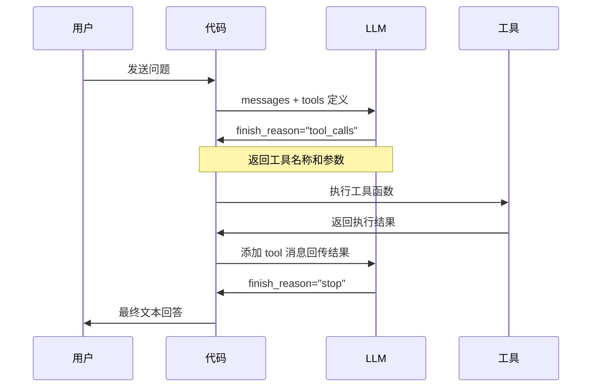
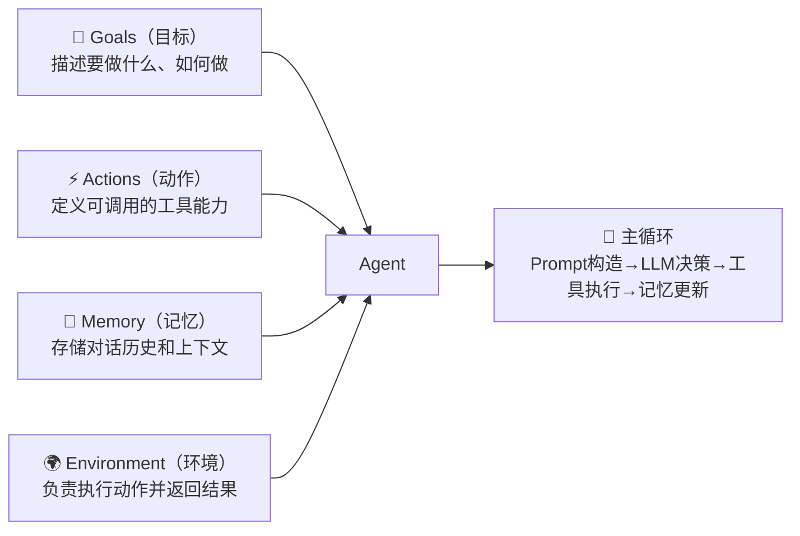

# 模块一：智能体基础与工具集成

> **学习目标**：理解AI智能体底层原理，掌握 Function Calling、GAME框架和 MCP 协议工具集成
>
> **前置知识**：Python 基础、OpenAI API 调用基础
>
> **代码位置**：`01-agent-tool-mcp/`

---

## 概述

本模块包含三个子模块，从浅入深地带你掌握智能体的工具调用能力：

| 子模块 | 内容 | 核心技能 |
|--------|------|----------|
| 1.1 工具调用基础 | Function Calling 原理与 Agent Loop | OpenAI tools 接口 |
| 1.2 从零构建智能体 | GAME 架构实现 | 智能体架构设计 |
| 1.3 MCP 协议集成 | MCP 服务端/客户端开发 | 标准化工具接入 |

---

## 环境准备

```bash
# 进入模块目录
cd 01-agent-tool-mcp/mcp-demo

# 安装依赖
pip install -r requirements.txt

# 配置环境变量
cp env.example .env
# 编辑 .env 文件，填入以下 API 密钥：
# OPENAI_API_KEY=sk-xxx
# OPENAI_BASE_URL=https://api.openai.com/v1
# DEEPSEEK_API_KEY=sk-xxx
# DEEPSEEK_BASE_URL=https://api.deepseek.com
# QWEATHER_API_KEY=xxx
# QWEATHER_API_BASE=devapi.qweather.com
```

---

## 子模块 1.1：工具调用基础

**代码位置**：`01-agent-tool-mcp/tool-use/`

### 1.1.1 什么是工具调用（Function Calling）

大模型本身只能生成文本，无法与外部系统交互。**工具调用（Function Calling）** 是解决这一问题的关键机制：

```
用户问题 → LLM 决策（选择工具+参数）→ 代码执行工具 → 结果回传 LLM → 最终回答
```

OpenAI 兼容 API 通过 `tools` 字段向模型暴露可调用的函数。每个工具定义如下：

```json
{
  "type": "function",
  "function": {
    "name": "get_weather",
    "description": "获取指定城市的天气信息",
    "parameters": {
      "type": "object",
      "properties": {
        "city": {
          "type": "string",
          "description": "城市名称，例如：北京"
        }
      },
      "required": ["city"],
      "additionalProperties": false
    }
  }
}
```

### 1.1.2 工具调用生命周期



### 1.1.3 Agent Loop 实现

工具调用往往需要多轮交互（如先搜索、再汇总）。核心是一个**循环结构**：

```python
import json
from openai import OpenAI

client = OpenAI(api_key="...", base_url="...")

def agent_loop(user_query: str, tools: list, tool_functions: dict) -> str:
    """
    智能体主循环：持续调用工具直到模型给出最终回答
    
    参数:
        user_query: 用户问题
        tools: OpenAI 格式的工具定义列表
        tool_functions: 工具名称到Python函数的映射字典
    """
    messages = [{"role": "user", "content": user_query}]
    
    # 设置最大轮次防止无限循环
    for _ in range(10):
        response = client.chat.completions.create(
            model="gpt-4o",
            messages=messages,
            tools=tools,
            tool_choice="auto"  # 让模型自主决定是否调用工具
        )
        
        choice = response.choices[0]
        
        if choice.finish_reason == "stop":
            # 模型已生成最终文本回答，退出循环
            return choice.message.content
            
        elif choice.finish_reason == "tool_calls":
            # 模型决定调用工具
            # 1. 将模型决策存入对话历史
            messages.append(choice.message.model_dump())
            
            # 2. 执行所有工具调用（支持并行调用）
            for tool_call in choice.message.tool_calls:
                tool_name = tool_call.function.name
                tool_args = json.loads(tool_call.function.arguments)
                
                # 执行工具函数
                result = tool_functions[tool_name](**tool_args)
                
                # 3. 将工具结果存入对话历史
                messages.append({
                    "role": "tool",
                    "tool_call_id": tool_call.id,
                    "content": str(result)
                })
    
    return "超出最大工具调用次数"
```

> **关键点**：
> - `finish_reason == "tool_calls"` 表示模型要调用工具，需继续循环
> - `finish_reason == "stop"` 表示模型已完成推理，退出循环
> - 每次循环都将工具结果回传给模型，模型根据累积信息做决策

---

## 子模块 1.2：从零构建智能体（GAME 框架）

**代码位置**：`01-agent-tool-mcp/ASimpleAgentFramework.ipynb`

### 1.2.1 GAME 框架概述

**GAME** 是一种通用的智能体架构设计范式，将智能体拆分为四个相互解耦的核心组件：



**设计优势**：
- **Goals** 与 **Actions** 分离，可以灵活替换工具集而不影响决策逻辑
- **Environment** 与 **Agent** 分离，可以切换执行环境（本地、云端、容器等）
- **AgentLanguage** 适配层，可以支持不同的 LLM 交互方式（函数调用、纯文本等）

### 1.2.2 核心组件实现

#### Goal — 目标定义

```python
from dataclasses import dataclass, field
from typing import List, Callable, Dict, Any

@dataclass(frozen=True)  # frozen=True 确保目标不可修改
class Goal:
    """智能体目标定义，包含优先级、名称和详细描述"""
    priority: int       # 目标优先级（用于排序）
    name: str           # 目标名称
    description: str    # 详细描述（同时包含"要做什么"和"如何做"）
```

#### Action — 工具/动作抽象

```python
class Action:
    """
    工具/动作的抽象封装
    
    - name: 暴露给 LLM 的工具名称
    - function: 实际执行的 Python 函数
    - description: 工具说明（LLM 用于选择工具）
    - parameters: JSON Schema（指导 LLM 组装参数）
    - terminal: 是否为终止型动作（选中后结束主循环）
    """
    def __init__(self, name: str, function: Callable, 
                 description: str, parameters: Dict, terminal: bool = False):
        self.name = name
        self.function = function
        self.description = description
        self.terminal = terminal
        self.parameters = parameters

    def execute(self, **args) -> Any:
        """执行底层函数，参数通过关键字形式解包传入"""
        return self.function(**args)


class ActionRegistry:
    """动作注册表：集中管理和检索工具"""
    def __init__(self):
        self.actions = {}

    def register(self, action: Action):
        self.actions[action.name] = action

    def get_action(self, name: str):
        return self.actions.get(name, None)

    def get_actions(self) -> List[Action]:
        return list(self.actions.values())
```

#### Memory — 记忆管理

```python
class Memory:
    """
    对话记忆管理
    
    统一存储 user/assistant/environment 等消息事件，
    通过 get_memories 返回对话历史供 Prompt 构造使用
    """
    def __init__(self):
        self.items = []

    def add_memory(self, memory: dict):
        """追加一条记忆事件"""
        self.items.append(memory)

    def get_memories(self, limit: int = None) -> List[Dict]:
        """获取对话历史，可通过 limit 控制上下文长度"""
        return self.items[:limit]
```

#### Environment — 执行环境

```python
import time, traceback

class Environment:
    """
    动作执行环境
    
    统一捕获异常，返回标准化结构：
    - tool_executed: 是否执行成功
    - result / error: 执行结果或错误信息
    - timestamp: 执行时间戳
    """
    def execute_action(self, action: Action, args: dict) -> dict:
        try:
            result = action.execute(**args)
            return {
                "tool_executed": True,
                "result": result,
                "timestamp": time.strftime("%Y-%m-%dT%H:%M:%S%z")
            }
        except Exception as e:
            return {
                "tool_executed": False,
                "error": str(e),
                "traceback": traceback.format_exc()
            }
```

#### AgentLanguage — 语言适配层

```python
import json
from typing import List

class AgentFunctionCallingActionLanguage:
    """
    基于 Function Calling 的语言适配实现
    
    - construct_prompt: 将 Goals/Actions/Memory 格式化为 LLM 的 Prompt
    - parse_response: 从 LLM 输出中解析工具名称和参数
    """
    
    def format_goals(self, goals: List[Goal]) -> List:
        """将所有目标合并为 system 消息"""
        sep = "\n-------------------\n"
        goal_instructions = "\n\n".join([
            f"{goal.name}:{sep}{goal.description}{sep}" 
            for goal in goals
        ])
        return [{"role": "system", "content": goal_instructions}]

    def format_actions(self, actions: List[Action]) -> list:
        """将 Action 列表转换为 OpenAI tools Schema"""
        return [
            {
                "type": "function",
                "function": {
                    "name": action.name,
                    "description": action.description[:1024],  # 描述不超过 1024 字符
                    "parameters": action.parameters,
                },
            }
            for action in actions
        ]

    def construct_prompt(self, actions, environment, goals, memory) -> dict:
        """构造最终 Prompt：Goals(system) + Memory(历史) + Actions(tools Schema)"""
        prompt_messages = []
        prompt_messages += self.format_goals(goals)
        prompt_messages += [
            {"role": "assistant" if item["type"] in ["assistant", "environment"] else "user",
             "content": item.get("content", json.dumps(item))}
            for item in memory.get_memories()
        ]
        tools = self.format_actions(actions)
        return {"messages": prompt_messages, "tools": tools}

    def parse_response(self, response: str) -> dict:
        """解析 LLM 响应，优先 JSON 解析，失败则退化为终止"""
        try:
            return json.loads(response)
        except Exception:
            return {"tool": "terminate", "args": {"message": response}}
```

#### Agent — 主控制器

```python
class Agent:
    """
    智能体主循环协调器
    
    将 Goals/Actions/Memory/Environment 协调起来：
    构造 Prompt → LLM 决策 → 解析动作 → 执行 → 更新记忆 → 终止判断
    """
    def __init__(self, goals, agent_language, action_registry, 
                 generate_response, environment):
        self.goals = goals
        self.generate_response = generate_response
        self.agent_language = agent_language
        self.actions = action_registry
        self.environment = environment

    def run(self, user_input: str, memory=None, max_iterations: int = 50) -> Memory:
        """执行智能体 GAME 主循环"""
        memory = memory or Memory()
        # 将用户任务写入记忆
        memory.add_memory({"type": "user", "content": user_input})

        for _ in range(max_iterations):
            # 1. 构造 Prompt（Goals + Memory历史 + Actions工具Schema）
            prompt = self.agent_language.construct_prompt(
                actions=self.actions.get_actions(),
                environment=self.environment,
                goals=self.goals,
                memory=memory
            )

            print("Agent thinking...")
            # 2. 发送给 LLM，获取决策（工具调用或文本）
            response = self.generate_response(prompt)
            print(f"Agent Decision: {response}")

            # 3. 解析工具名称和参数
            invocation = self.agent_language.parse_response(response)
            action = self.actions.get_action(invocation["tool"])

            # 4. 在环境中执行动作
            result = self.environment.execute_action(action, invocation["args"])
            print(f"Action Result: {result}")

            # 5. 将决策和结果写回记忆
            memory.add_memory({"type": "assistant", "content": response})
            memory.add_memory({"type": "environment", "content": json.dumps(result)})

            # 6. 终止判断
            if action.terminal:
                break

        return memory
```

### 1.2.3 完整示例：文件读取智能体

```python
# 定义工具函数
import os
from pathlib import Path

def list_project_files() -> list:
    """列出项目中的所有文件"""
    return [str(p) for p in Path(".").rglob("*.py") if not p.name.startswith(".")]

def read_project_file(name: str) -> str:
    """读取项目文件内容"""
    return Path(name).read_text(encoding="utf-8")

def terminate(message: str) -> str:
    """终止智能体并输出最终结果"""
    print(f"\n✅ 智能体完成任务：{message}\nTerminating...")
    return message

# 注册工具
registry = ActionRegistry()
registry.register(Action(
    name="list_project_files",
    function=list_project_files,
    description="列出项目中所有 Python 文件的路径",
    parameters={"type": "object", "properties": {}, "required": []}
))
registry.register(Action(
    name="read_project_file",
    function=read_project_file,
    description="读取指定路径的项目文件内容",
    parameters={
        "type": "object",
        "properties": {"name": {"type": "string", "description": "文件路径"}},
        "required": ["name"]
    }
))
registry.register(Action(
    name="terminate",
    function=terminate,
    description="任务完成后调用此工具，输出最终结果",
    parameters={
        "type": "object",
        "properties": {"message": {"type": "string", "description": "最终输出内容"}},
        "required": ["message"]
    },
    terminal=True  # 标记为终止型动作
))

# 定义目标
goals = [Goal(
    priority=1,
    name="文件分析任务",
    description="""
    你是一个文件分析智能体。你的任务是：
    1. 先调用 list_project_files 查看项目文件列表
    2. 逐一读取感兴趣的文件
    3. 分析完所有文件后，调用 terminate 输出分析摘要
    """
)]

# 创建并运行智能体
agent = Agent(
    goals=goals,
    agent_language=AgentFunctionCallingActionLanguage(),
    action_registry=registry,
    generate_response=generate_response,  # LLM 调用函数
    environment=Environment()
)

memory = agent.run("请分析项目文件并生成摘要报告")
```

**预期输出**：
```
Agent thinking...
Agent Decision: {"tool": "list_project_files", "args": {}}
Action Result: {'tool_executed': True, 'result': ['mcp-demo/server/weather_server.py', ...]}
Agent thinking...
Agent Decision: {"tool": "read_project_file", "args": {"name": "mcp-demo/server/weather_server.py"}}
...
Agent Decision: {"tool": "terminate", "args": {"message": "项目分析摘要：..."}}
✅ 智能体完成任务：项目分析摘要：...
```

---

## 子模块 1.3：MCP 协议集成

**代码位置**：`01-agent-tool-mcp/mcp-demo/`

### 1.3.1 什么是 MCP

**Model Context Protocol（MCP）** 是 Anthropic 主导的开放协议，解决了 AI 模型与外部工具/资源之间的**标准化集成**问题。

```
传统方式：每个工具都需要定制代码接入 ←→ MCP：一套协议，接入任意工具
```

MCP 服务器可提供三种类型的功能：
- **Resources**（资源）：类似文件的数据，客户端可以读取
- **Tools**（工具）：可由 LLM 调用的函数
- **Prompts**（提示词）：预编写的模板，帮助用户完成特定任务

### 1.3.2 MCP 服务端开发（FSastMCP）

**代码**：`mcp-demo/server/weather_server.py`

使用 `fastmcp` 库可以极简地构建 MCP 服务器：

```python
from mcp.server.fastmcp import FastMCP
import httpx, os

# 1. 初始化 FastMCP 服务器
mcp = FastMCP(
    "weather",      # 服务器名称（客户端标识用）
    debug=True,     # 启用调试日志
    host="0.0.0.0"  # 监听所有网络接口
)

# 2. 使用 @mcp.tool() 装饰器注册工具
# 函数的 docstring 会自动成为工具的描述，参数类型注解会自动生成 Schema
@mcp.tool()
async def get_weather_warning(location: str) -> str:
    """
    获取指定位置的天气灾害预警
    
    参数:
        location: 城市ID或经纬度坐标（如 '101010100' 表示北京）
    """
    params = {"location": location, "lang": "zh"}
    data = await make_qweather_request("v7/warning/now", params)
    
    if not data or data.get("code") != "200":
        return f"API 返回错误: {data.get('code') if data else '请求失败'}"
    
    warnings = data.get("warning", [])
    if not warnings:
        return f"当前位置 {location} 没有活动预警。"
    
    return "\n---\n".join([format_warning(w) for w in warnings])


@mcp.tool()
async def get_daily_forecast(location: str, days: int = 3) -> str:
    """
    获取指定位置的天气预报
    
    参数:
        location: 城市ID或经纬度坐标
        days: 预报天数（3/7/10/15/30，默认3）
    """
    valid_days = [3, 7, 10, 15, 30]
    days = days if days in valid_days else 3
    
    data = await make_qweather_request(f"v7/weather/{days}d", {"location": location, "lang": "zh"})
    
    if not data or data.get("code") != "200":
        return "获取天气预报失败"
    
    forecasts = data.get("daily", [])
    return "\n---\n".join([format_daily_forecast(f) for f in forecasts])


# 3. 启动服务器，使用 stdio 传输方式（与客户端通过标准输入输出通信）
if __name__ == "__main__":
    mcp.run(transport='stdio')
```

**关键设计点**：
- `@mcp.tool()` 自动将函数注册为 MCP 工具
- 函数的 docstring 自动成为工具描述
- 参数类型注解自动生成 JSON Schema
- `transport='stdio'` 使用标准输入输出与客户端通信

### 1.3.3 MCP 客户端开发

**代码**：`mcp-demo/client/mcp_client_deepseek.py`

MCP 客户端负责连接服务器、获取工具列表，并将工具转换为 LLM 可识别的格式：

```python
from mcp import ClientSession, StdioServerParameters
from mcp.client.stdio import stdio_client
from contextlib import AsyncExitStack
from openai import OpenAI
import json, asyncio

class MCPServer:
    """MCP 服务器连接管理"""
    
    def __init__(self, server_path: str):
        self.server_path = server_path
        self.session = None
        self.exit_stack = AsyncExitStack()

    async def initialize(self):
        """连接到 MCP 服务器（含重试机制）"""
        server_params = StdioServerParameters(
            command='python',
            args=[self.server_path]
        )
        # 启动服务器子进程并建立 stdio 通信通道
        stdio_transport = await self.exit_stack.enter_async_context(
            stdio_client(server_params)
        )
        stdio, write = stdio_transport
        
        # 创建 MCP 会话
        self.session = await self.exit_stack.enter_async_context(
            ClientSession(stdio, write)
        )
        await self.session.initialize()

    async def list_tools(self):
        """获取服务器提供的工具列表，转换为 OpenAI 格式"""
        response = await self.session.list_tools()
        return [
            {
                "type": "function",
                "function": {
                    "name": tool.name,
                    "description": tool.description,
                    "parameters": tool.inputSchema
                }
            }
            for tool in response.tools
        ]

    async def execute_tool(self, tool_name: str, arguments: dict):
        """调用 MCP 工具"""
        result = await self.session.call_tool(tool_name, arguments)
        return result.content[0].text  # 返回文本内容
```

```python
class MCPClient:
    """集成 DeepSeek 的 MCP 客户端"""
    
    def __init__(self, api_key: str, base_url: str, model: str):
        self.llm = OpenAI(api_key=api_key, base_url=base_url)
        self.model = model
        self.server = None

    async def process_query(self, query: str) -> str:
        """
        处理用户查询，支持多轮工具调用
        
        工作流程：
        1. 获取工具列表
        2. 发送给 LLM
        3. 如果 LLM 要调用工具，执行并回传结果
        4. 重复步骤 2-3 直到 LLM 给出最终回答
        """
        messages = [
            {"role": "system", "content": "你是一个专业的天气助手..."},
            {"role": "user", "content": query}
        ]
        
        available_tools = await self.server.list_tools()
        
        # 多轮工具调用循环
        for _ in range(5):  # 最多5轮工具调用
            response = self.llm.chat.completions.create(
                model=self.model,
                messages=messages,
                tools=available_tools,
                tool_choice="auto"
            )
            
            content = response.choices[0].message
            finish_reason = response.choices[0].finish_reason
            
            if finish_reason == "stop":
                return content.content  # ✅ 最终回答
                
            elif finish_reason == "tool_calls":
                # LLM 决定调用工具
                messages.append(content.model_dump())
                
                # 批量执行工具调用
                for tool_call in content.tool_calls:
                    tool_name = tool_call.function.name
                    tool_args = json.loads(tool_call.function.arguments)
                    
                    result = await self.server.execute_tool(tool_name, tool_args)
                    
                    # 将结果回传给 LLM
                    messages.append({
                        "role": "tool",
                        "content": result,
                        "tool_call_id": tool_call.id,
                    })
        
        return "未能获取最终回答"
```

### 1.3.4 LangChain 版本（更简洁）

**代码**：`mcp-demo/client/mcp_client_langchain_chat.py`

使用 `langchain-mcp-adapters` 可以更简洁地集成 MCP 工具：

```python
from langchain_mcp_adapters.tools import load_mcp_tools
from langchain_openai import ChatOpenAI
from langgraph.prebuilt import create_react_agent

# LangChain 方式：load_mcp_tools 自动适配 MCP 工具格式，无需手动转换
tools = await load_mcp_tools(session)

# 使用 create_react_agent 一行创建支持工具调用的 ReAct 智能体
agent = create_react_agent(
    model=ChatOpenAI(model="deepseek-chat", base_url="..."),
    tools=tools,
    prompt=SystemMessage(content="你是专业的天气助手...")
)

# 发送查询并获取回答
response = await agent.ainvoke({"messages": "北京今天天气怎么样？"})
```

> **对比**：
> - 原生方式：手动管理消息历史，手动解析工具调用，需要实现多轮循环
> - LangChain 方式：`create_react_agent` 自动处理所有这些，代码更简洁
> - 权衡：原生方式更透明可控，LangChain 方式更高效快捷

### 1.3.5 运行 MCP 天气助手

```bash
# 终端1：启动 MCP 服务器（后台运行）
cd 01-agent-tool-mcp/mcp-demo
python server/weather_server.py

# 终端2：运行 MCP 客户端
python client/mcp_client_deepseek.py

# 输入天气查询，例如：
# 请输入你的问题: 北京今天有没有天气预警？未来3天天气如何？
```

**预期效果**：
```
助手: 根据和风天气数据查询，当前北京没有活动预警。
未来3天天气预报：
日期: 2025-03-10  最高温度: 18°C  最低温度: 6°C  天气: 晴
日期: 2025-03-11  最高温度: 20°C  最低温度: 8°C  天气: 多云
日期: 2025-03-12  最高温度: 15°C  最低温度: 5°C  天气: 小雨
建议携带雨具，周末出行注意防雨。
```

---

## 模块总结

### 核心知识点回顾

| 概念 | 要点 |
|------|------|
| **Function Calling** | LLM 通过 `tools` 参数获知可用工具，返回 `tool_calls` 决策 |
| **Agent Loop** | `finish_reason="tool_calls"` → 执行 → 回传 → 重复，直到 `"stop"` |
| **GAME 框架** | Goals/Actions/Memory/Environment 解耦，可独立替换各组件 |
| **MCP 协议** | 标准化工具接入，`@mcp.tool()` 自动注册，`stdio` 通信 |
| **LangChain 集成** | `load_mcp_tools` + `create_react_agent` 快速构建工具调用智能体 |

### 学习路径

```
工具调用基础（1.1）→ 自己实现 Agent Loop
       ↓
GAME 框架（1.2）→ 理解架构设计，将各组件解耦
       ↓
MCP 协议（1.3）→ 接入真实外部服务，标准化工具集成
       ↓
下一步：模块2 - 使用 LangGraph 构建多节点工作流
```

### 推荐练习

1. **扩展工具集**：为 GAME 框架添加新工具（如搜索引擎、数据库查询）
2. **改造 MCP 服务器**：将任意 Python 函数改造为 MCP 工具，供其他项目使用
3. **多模型支持**：修改 `generate_response` 函数，让 GAME 框架支持多种 LLM 提供商
