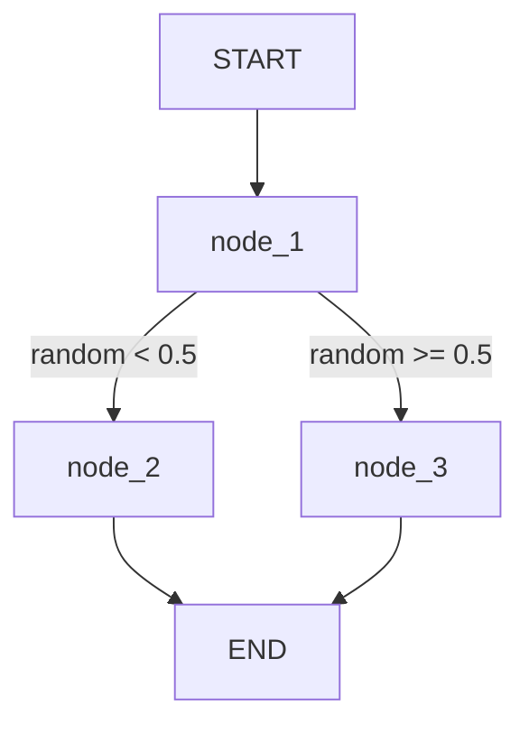
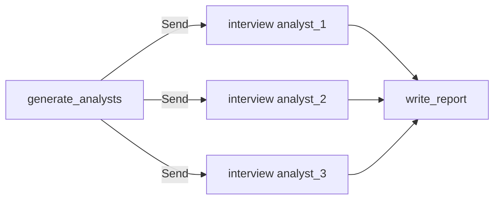
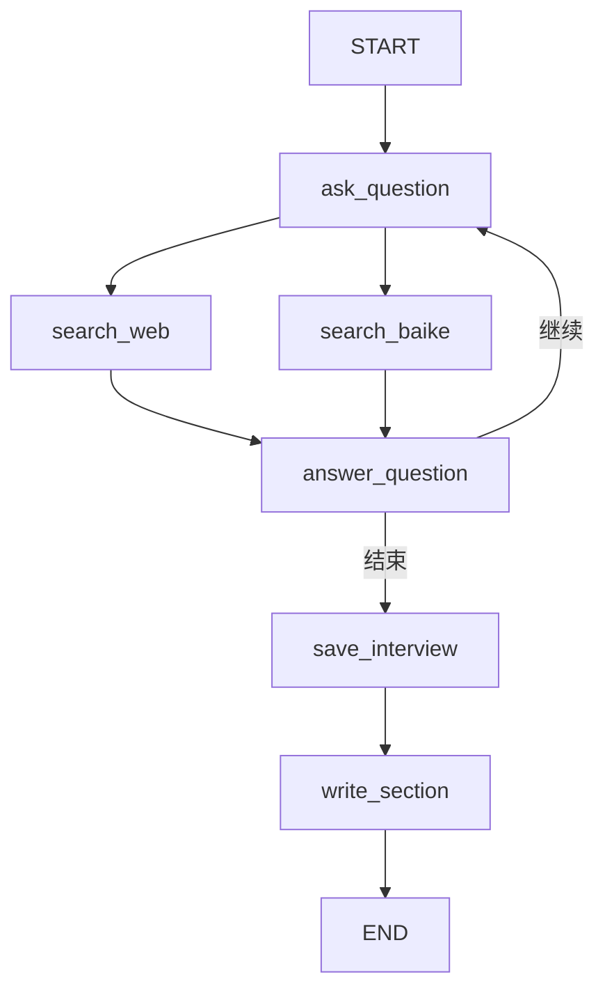
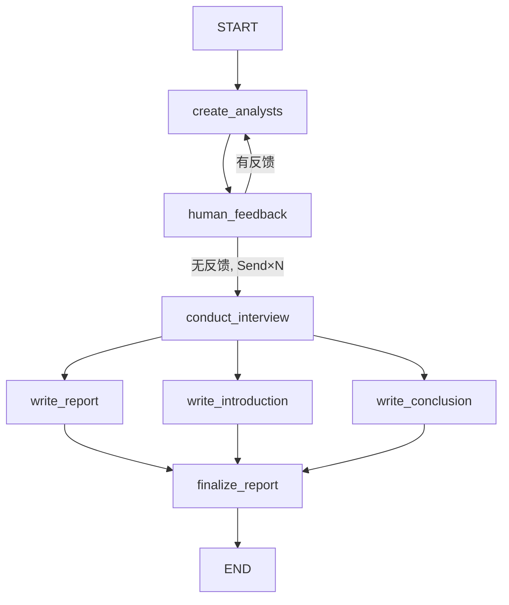

# 模块二：多角色智能体系统

> **学习目标**：掌握 LangGraph 工作流编排，构建多角色协作的智能体系统，实现深度研究助手
>
> **前置知识**：模块1基础（工具调用、Agent Loop）、LangChain 基础
>
> **代码位置**：`02-agent-multi-role/`

---

## 概述

本模块从 LangGraph 基础讲起，逐步构建一个能自动完成深度研究的多角色智能体系统：

| 子模块 | 内容 | 核心技能 |
|--------|------|----------|
| 2.1 LangGraph 基础 | State/Nodes/Edges/条件路由 | 图状态机编程 |
| 2.2 LangGraph 进阶 | 子图、并行执行、人机协同 | 复杂工作流设计 |
| 2.3 深度研究助手 | Map-Reduce 多智能体协作 | 生产级系统开发 |

---

## 环境准备

```bash
cd 02-agent-multi-role/deepresearch

# 关键依赖
pip install langgraph==0.6.7 langchain-openai langchain-community
pip install tavily-python wikipedia duckduckgo-search

# 环境变量
OPENAI_API_KEY=sk-xxx
OPENAI_BASE_URL=https://api.openai.com/v1
TAVILY_API_KEY=tvly-xxx
```

---

## 子模块 2.1：LangGraph 基础

**代码位置**：`02-agent-multi-role/langgraph/1-Base/`

### 2.1.1 为什么用 LangGraph

LangGraph 将智能体工作流建模为**有状态的有向图**：

```
传统 Agent Loop：线性循环，难以表达分支和并行
LangGraph：有向图，天然支持：
  ✅ 条件分支（if-else 路由）    ✅ 并行执行（Fork-Join）
  ✅ 循环结构（回到历史节点）    ✅ 子图嵌套（复杂系统）
  ✅ 状态持久化（断点续传）      ✅ 人机协同（中断点）
```

### 2.1.2 核心概念

LangGraph 的三个核心概念构成了工作流的基础：

```
State（状态）→ 数据容器，所有节点共享
Nodes（节点）→ 处理函数，接收并返回状态
Edges（边） → 执行路径，连接节点
```

### 2.1.3 定义状态（State）

```python
from typing_extensions import TypedDict

class State(TypedDict):
    """
    图的共享状态 - 所有节点都可以读取和修改
    
    关键要点：
    - 继承 TypedDict，提供类型安全
    - 所有字段在整个图执行过程中持续存在
    - 节点返回的 dict 会自动合并到状态中
    """
    graph_state: str  # 在图执行过程中传递文本信息
```

> **为什么用 TypedDict**：比普通 dict 提供更好的类型检查，IDE 可以自动补全节点返回的字段名，减少拼写错误。

### 2.1.4 定义节点（Nodes）

节点就是普通的 Python 函数，必须接收 `state` 并返回包含更新字段的 `dict`：

```python
def node_1(state: State) -> dict:
    """第一个节点：在文本后追加 ' I am'"""
    print("---Node 1---")
    return {"graph_state": state['graph_state'] + " I am"}

def node_2(state: State) -> dict:
    """选择路径：开心分支"""
    print("---Node 2---")
    return {"graph_state": state['graph_state'] + " happy!"}

def node_3(state: State) -> dict:
    """选择路径：悲伤分支"""
    print("---Node 3---")
    return {"graph_state": state['graph_state'] + " sad!"}
```

> **状态更新机制**：节点返回的 dict 会**覆盖**同名字段（默认）。如果需要**追加**（如消息列表），需要使用 `Annotated` + `operator.add` 声明 Reducer（见 2.2.2 节）。

### 2.1.5 定义边（Edges）

边分两种类型：

```python
import random
from typing import Literal

# 条件边函数：返回下一个节点名称
def decide_mood(state: State) -> Literal["node_2", "node_3"]:
    """根据状态决定下一个节点。实际应用中可基于 LLM 输出做决策。"""
    if random.random() < 0.5:
        return "node_2"  # 50% 概率走开心路径
    return "node_3"      # 50% 概率走悲伤路径
```

### 2.1.6 构建并运行图

```python
from langgraph.graph import StateGraph, START, END

# 1. 创建图构建器
builder = StateGraph(State)

# 2. 注册节点
builder.add_node("node_1", node_1)
builder.add_node("node_2", node_2)
builder.add_node("node_3", node_3)

# 3. 定义边（执行路径）
builder.add_edge(START, "node_1")          # 从起点到 node_1（固定边）
builder.add_conditional_edges(             # 条件边：node_1 之后根据函数决定路径
    "node_1",
    decide_mood,
    ["node_2", "node_3"]   # 可能的目标节点列表
)
builder.add_edge("node_2", END)            # 固定边到终点
builder.add_edge("node_3", END)            # 固定边到终点

# 4. 编译
graph = builder.compile()

# 5. 执行（始终传入完整的初始状态）
result = graph.invoke({"graph_state": "Hi, this is Lance."})
print(result["graph_state"])
# 可能输出：Hi, this is Lance. I am happy!
# 或输出：  Hi, this is Lance. I am sad!
```

**图结构可视化**：



---

## 子模块 2.2：LangGraph 进阶

**代码位置**：`02-agent-multi-role/langgraph/2-Advance/`

### 2.2.1 消息状态（MessagesState）

LangGraph 内置了 `MessagesState`，专门用于管理对话历史：

```python
from langgraph.graph import MessagesState

# MessagesState 等价于：
class MessagesState(TypedDict):
    messages: Annotated[list[AnyMessage], add_messages]
# add_messages 是内置 Reducer：自动追加新消息而不是覆盖

# 直接使用内置 MessagesState
class MyState(MessagesState):
    # 可以在 messages 之外添加自定义字段
    summary: str  # 例如对话摘要
```

### 2.2.2 Reducer：控制状态更新方式

默认情况下，节点返回的字段会**覆盖**状态中的同名字段。通过 `Annotated + Reducer` 可以改变这一行为：

```python
import operator
from typing import Annotated

class ResearchState(TypedDict):
    topic: str                                    # 普通字段：后写覆盖
    sections: Annotated[list, operator.add]       # 追加型：每次调用会累加
    messages: Annotated[list, add_messages]       # 消息型：自动处理去重和更新
```

**典型使用场景**：多个并行节点各自生成一个报告小节，需要将所有小节累积到 `sections` 列表中，而不是相互覆盖。

### 2.2.3 并行执行（Send API）

`Send` 是 LangGraph 实现动态并行的核心机制：

```python
from langgraph.types import Send

def fan_out(state: State) -> list[Send]:
    """
    动态 Fan-out：为每个分析师创建一个并行任务
    
    与静态并行边（add_edge 到多个节点）不同，
    Send 可以动态决定创建多少个并行任务，并为每个任务提供独立的初始状态。
    """
    return [
        Send("process_analyst", {"analyst": analyst, "topic": state["topic"]})
        for analyst in state["analysts"]
    ]

# 在图中注册
builder.add_conditional_edges("fan_out_node", fan_out)
```

**Fan-out / Fan-in 模式**：



### 2.2.4 人机协同（Human-in-the-Loop）

LangGraph 通过 `interrupt_before` 参数实现工作流暂停：

```python
from langgraph.checkpoint.memory import MemorySaver

memory = MemorySaver()
graph = builder.compile(
    checkpointer=memory,
    interrupt_before=["human_review"]  # 在此节点前暂停
)

# 执行工作流，在中断点停止
config = {"configurable": {"thread_id": "session_001"}}
result = graph.invoke(initial_state, config)
# 此时工作流停在 human_review 节点前

# 人类审核并提供反馈
graph.update_state(
    config,
    {"human_feedback": "请增加关于安全风险的分析师"},
    as_node="human_review"
)

# 从中断点恢复执行（传 None 继续）
final_result = graph.invoke(None, config)
```

### 2.2.5 子图（Subgraphs）

复杂工作流可以通过嵌套子图来模块化：

```python
# 1. 构建并编译子图
sub_builder = StateGraph(InterviewState)
sub_builder.add_node("ask", generate_question)
sub_builder.add_node("answer", generate_answer)
sub_builder.add_edge(START, "ask")
sub_builder.add_edge("ask", "answer")
sub_builder.add_edge("answer", END)
sub_graph = sub_builder.compile()

# 2. 在主图中作为节点使用
main_builder = StateGraph(ResearchState)
main_builder.add_node("conduct_interview", sub_graph)  # 子图直接作为节点
main_builder.add_edge(START, "conduct_interview")
main_graph = main_builder.compile()
```

---

## 子模块 2.3：深度研究助手（实战项目）

**代码位置**：`02-agent-multi-role/deepresearch/deployment/research_assistant.py`

### 2.3.1 系统架构

深度研究助手以 **Map-Reduce 模式**组织多智能体协作：

```
输入: topic（研究主题）+ max_analysts（分析师数量）
  ↓
[Map 阶段] 生成3-5个分析师 → 每个分析师并行访谈（搜索+问答）→ 小节报告
  ↓
[Reduce 阶段] 整合所有小节 → 并行生成引言/主体/结论 → 组装最终报告
  ↓
输出: 完整的 Markdown 格式研究报告
```

### 2.3.2 数据模型

系统使用 Pydantic 模型确保数据一致性：

```python
from pydantic import BaseModel, Field
from typing_extensions import TypedDict
from typing import List, Annotated
import operator

class Analyst(BaseModel):
    """AI 分析师的完整人设信息"""
    affiliation: str = Field(description="所属机构（如：麻省理工学院）")
    name: str = Field(description="分析师姓名")
    role: str = Field(description="专业角色定位（如：技术专家、政策分析师）")
    description: str = Field(description="关注焦点和研究动机详述")

    @property
    def persona(self) -> str:
        """格式化人设描述，用于提示词注入"""
        return f"Name: {self.name}\nRole: {self.role}\nAffiliation: {self.affiliation}\nDescription: {self.description}\n"


class ResearchGraphState(TypedDict):
    """主工作流全局状态"""
    topic: str               # 研究主题
    max_analysts: int        # 分析师上限
    human_analyst_feedback: str  # 人类审核反馈
    analysts: List[Analyst]  # 生成的分析师列表
    
    # 使用 operator.add 作为 Reducer，支持多个并行访谈结果累加
    sections: Annotated[list, operator.add]
    
    introduction: str        # 报告引言
    content: str             # 报告主体
    conclusion: str          # 报告结论
    final_report: str        # 最终完整报告


class InterviewState(MessagesState):
    """访谈子图状态（继承 MessagesState 管理对话）"""
    max_num_turns: int       # 最大访谈轮次
    context: Annotated[list, operator.add]  # 检索到的文档（累加型）
    analyst: Analyst         # 当前分析师
    interview: str           # 完整访谈记录
    sections: list           # 生成的报告小节
```

### 2.3.3 关键节点实现

#### 分析师生成节点

```python
def create_analysts(state: GenerateAnalystsState):
    """
    使用 LLM 结构化输出生成多个分析师
    
    关键：with_structured_output(Perspectives) 让 LLM 直接输出符合
    Pydantic 模型的数据，无需手动解析
    """
    structured_llm = llm.with_structured_output(Perspectives)  # 绑定输出模型
    
    system_message = analyst_instructions.format(
        topic=state['topic'],
        human_analyst_feedback=state.get('human_analyst_feedback', ''),
        max_analysts=state['max_analysts']
    )
    
    analysts = structured_llm.invoke([
        SystemMessage(content=system_message),
        HumanMessage(content="生成分析师集合。")
    ])
    
    return {"analysts": analysts.analysts}  # 返回 Analyst 对象列表
```

#### 并行搜索节点（Web + 百科）

```python
def search_web(state: InterviewState):
    """基于对话历史生成查询，使用 Tavily 搜索"""
    structured_llm = llm.with_structured_output(SearchQuery)
    search_query = structured_llm.invoke([search_instructions] + state['messages'])
    
    search_docs = tavily_search.invoke(search_query.search_query)
    
    # 格式化为 XML 格式，包含来源 URL，便于后续引用
    formatted_docs = "\n\n---\n\n".join([
        f'<Document href="{doc["url"]}"/>\n{doc["content"]}\n</Document>'
        for doc in search_docs
    ])
    return {"context": [formatted_docs]}


def search_baike(state: InterviewState):
    """从维基百科检索权威背景知识"""
    structured_llm = llm.with_structured_output(SearchQuery)
    search_query = structured_llm.invoke([search_instructions] + state['messages'])
    
    # 最多加载 2 篇 Wikipedia 文档
    docs = WikipediaLoader(query=search_query.search_query, load_max_docs=2).load()
    
    formatted_docs = "\n\n---\n\n".join([
        f'<Document source="{doc.metadata["source"]}" page="{doc.metadata.get("page", "")}"/>\n{doc.page_content}\n</Document>'
        for doc in docs
    ])
    return {"context": [formatted_docs]}
```

#### 访谈路由节点

```python
def route_messages(state: InterviewState, name: str = "expert") -> str:
    """
    决定访谈是否继续：
    - 达到最大轮次 → 结束
    - 分析师说了结束语 → 结束  
    - 否则 → 继续提问
    """
    messages = state["messages"]
    max_num_turns = state.get('max_num_turns', 2)
    
    # 统计专家回答次数
    num_responses = len([m for m in messages 
                         if isinstance(m, AIMessage) and m.name == name])
    
    if num_responses >= max_num_turns:
        return 'save_interview'
    
    # 检查分析师是否主动结束
    last_question = messages[-2]
    if "非常感谢您的帮助!" in last_question.content:
        return 'save_interview'
    
    return "ask_question"
```

#### Map 阶段：启动并行访谈

```python
def initiate_all_interviews(state: ResearchGraphState):
    """
    Map 步骤：为每个分析师创建并行访谈任务
    
    使用 Send API 动态创建 N 个并行的访谈子图实例
    每个 Send 携带不同的初始状态（不同的分析师）
    """
    if state.get('human_analyst_feedback'):
        return "create_analysts"  # 有反馈，重新生成分析师
    
    topic = state["topic"]
    return [
        Send("conduct_interview", {
            "analyst": analyst,
            "messages": [HumanMessage(
                content=f"所以你说你在写一篇关于{topic}的文章?"
            )]
        })
        for analyst in state["analysts"]
    ]
```

### 2.3.4 构建访谈子图

```python
from langgraph.graph import StateGraph, START, END
from langgraph.checkpoint.memory import MemorySaver

# --- 访谈子图 ---
interview_builder = StateGraph(InterviewState)

# 添加节点
interview_builder.add_node("ask_question", generate_question)
interview_builder.add_node("search_web", search_web)
interview_builder.add_node("search_baike", search_baike)
interview_builder.add_node("answer_question", generate_answer)
interview_builder.add_node("save_interview", save_interview)
interview_builder.add_node("write_section", write_section)

# 定义执行流程
interview_builder.add_edge(START, "ask_question")

# 提问后，Web 搜索和百科搜索【并行执行】
interview_builder.add_edge("ask_question", "search_web")
interview_builder.add_edge("ask_question", "search_baike")

# 两个搜索都完成后，汇聚到回答节点（Fan-in）
interview_builder.add_edge("search_web", "answer_question")
interview_builder.add_edge("search_baike", "answer_question")

# 回答后，条件路由：继续提问 or 结束访谈
interview_builder.add_conditional_edges(
    "answer_question",
    route_messages,
    ['ask_question', 'save_interview']
)

interview_builder.add_edge("save_interview", "write_section")
interview_builder.add_edge("write_section", END)

# 编译子图
interview_graph = interview_builder.compile(checkpointer=MemorySaver())
```

**访谈子图工作流**：



### 2.3.5 构建主研究图

```python
# --- 主研究图 ---
builder = StateGraph(ResearchGraphState)

# 添加所有功能节点
builder.add_node("create_analysts", create_analysts)
builder.add_node("human_feedback", human_feedback)         # 空节点，作为中断点
builder.add_node("conduct_interview", interview_graph)     # 子图作为节点
builder.add_node("write_report", write_report)
builder.add_node("write_introduction", write_introduction)
builder.add_node("write_conclusion", write_conclusion)
builder.add_node("finalize_report", finalize_report)

# 定义执行流程
builder.add_edge(START, "create_analysts")
builder.add_edge("create_analysts", "human_feedback")

# 在 human_feedback 后：有反馈则重新生成，无反馈则启动并行访谈
builder.add_conditional_edges(
    "human_feedback",
    initiate_all_interviews,    # 返回 Send 列表（并行）或节点名（重定向）
    ["create_analysts", "conduct_interview"]
)

# 所有访谈完成后，【并行】生成报告三部分
builder.add_edge("conduct_interview", "write_report")
builder.add_edge("conduct_interview", "write_introduction")
builder.add_edge("conduct_interview", "write_conclusion")

# 三部分完成后汇聚（Fan-in），组装最终报告
builder.add_edge(
    ["write_conclusion", "write_report", "write_introduction"],
    "finalize_report"
)
builder.add_edge("finalize_report", END)

# 编译主图（在 human_feedback 前中断，等待人类审核）
memory = MemorySaver()
graph = builder.compile(
    interrupt_before=['human_feedback'],
    checkpointer=memory
)
```

**主研究图工作流**：



### 2.3.6 运行深度研究助手

```python
import asyncio

async def run_research(topic: str, max_analysts: int = 3):
    config = {"configurable": {"thread_id": "research_001"}}
    
    # 阶段1：生成分析师（遇到中断点停止）
    initial_state = {"topic": topic, "max_analysts": max_analysts}
    result = graph.invoke(initial_state, config)
    
    # 查看生成的分析师
    analysts = graph.get_state(config).values['analysts']
    for a in analysts:
        print(f"分析师：{a.name} ({a.role})")
    
    # 可选：提供反馈重新生成（跳过则直接继续）
    # graph.update_state(config, {"human_analyst_feedback": "需要增加AI伦理专家"})
    
    # 阶段2：继续执行（从中断点恢复）
    final_result = graph.invoke(None, config)
    
    return final_result["final_report"]


# 运行
topic = "人工智能在医疗诊断中的应用与挑战"
report = asyncio.run(run_research(topic))
print(report)
```

**预期输出**：自动生成包含引言、多个专题小节和结论的 Markdown 格式研究报告，每个论点都有来源引用。

---

## 模块总结

### 核心知识点回顾

| 概念 | 要点 |
|------|------|
| **State** | `TypedDict` 定义共享状态，`Annotated+Reducer` 控制字段更新方式 |
| **Nodes** | 普通 Python 函数，接收 state 返回 dict；子图也可作为节点 |
| **Edges** | 固定边 `add_edge`，条件边 `add_conditional_edges` |
| **Send API** | 动态并行：根据数据量创建 N 个并行任务 |
| **人机协同** | `interrupt_before` 暂停，`update_state` 注入反馈，`invoke(None)` 恢复 |
| **Checkpointer** | `MemorySaver` 状态持久化，支持断点续传 |
| **Map-Reduce** | Send 实现 Fan-out，`Annotated[list, operator.add]` 实现 Fan-in |

### LangGraph vs 手写 Agent Loop

| 对比维度 | 手写 Agent Loop（模块1） | LangGraph（模块2） |
|----------|--------------------------|---------------------|
| 并行执行 | ❌ 需要手写 asyncio | ✅ Send API 自动并行 |
| 状态持久化 | ❌ 不支持 | ✅ Checkpointer |
| 人机协同 | ❌ 需要额外设计 | ✅ interrupt_before |
| 复杂分支 | ✅ 自由控制 | ✅ 条件边 |
| 学习成本 | ✅ 低 | 中等 |
| 适用场景 | 简单场景快速原型 | 生产级多角色系统 |

### 学习路径

```
LangGraph 基础（2.1）→ 掌握 State/Nodes/Edges 三要素
       ↓
进阶特性（2.2）→ 并行、子图、人机协同
       ↓
深度研究助手（2.3）→ Map-Reduce 多智能体实战
       ↓
下一步：模块3 - 使用 FastAPI + Streamlit + Docker 部署企业级系统
```

### 推荐练习

1. **修改路由逻辑**：让条件路由基于 LLM 的判断而非随机数，实现智能分支
2. **添加新分析师角色**：在深度研究助手中添加"政策分析师"或"伦理学家"角色
3. **持久化存储**：将 `MemorySaver` 替换为 `SqliteSaver`，实现跨会话的状态持久化
