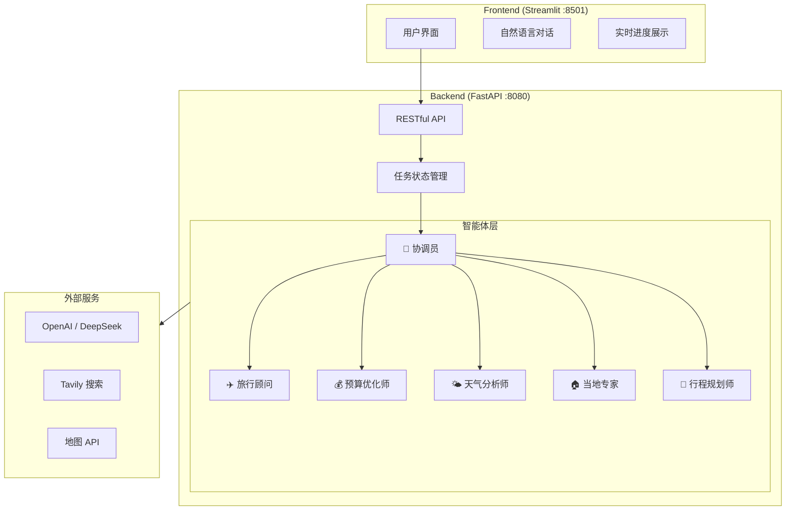
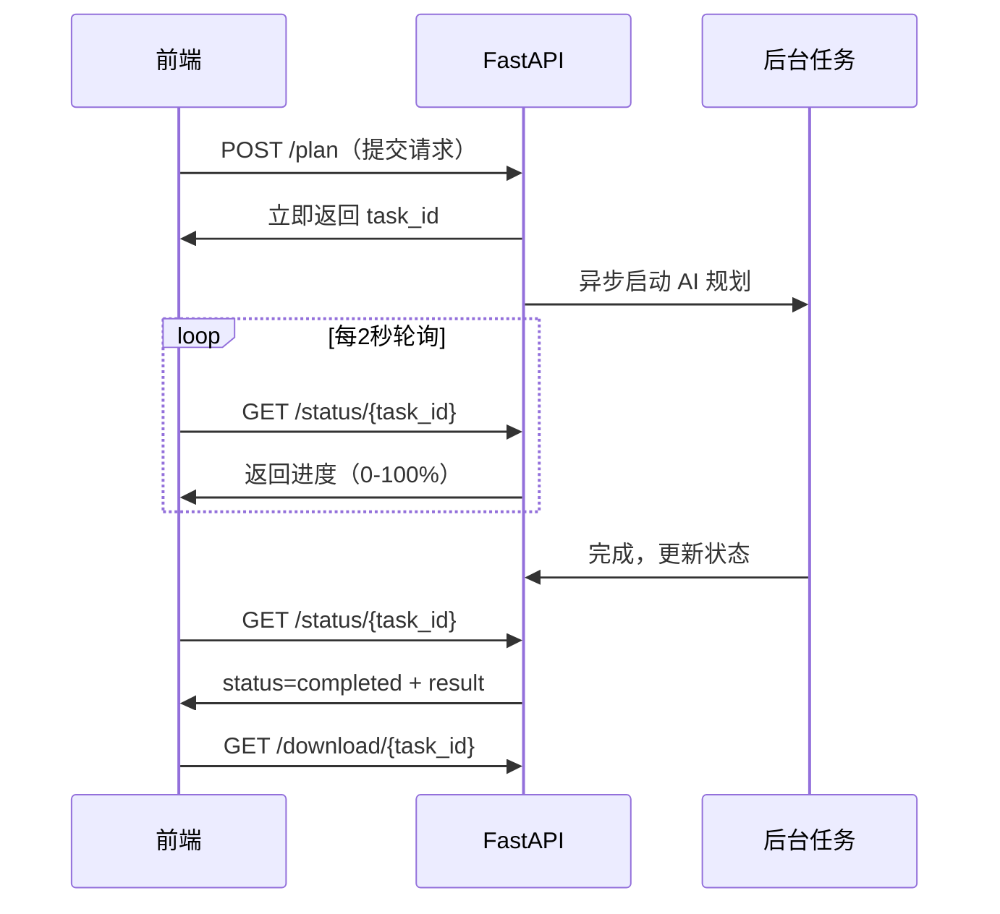

# 模块三：企业级智能体系统搭建与部署

> **学习目标**：将 AI 智能体包装为生产级服务，掌握 FastAPI + Streamlit + Docker 的完整部署方案
>
> **前置知识**：模块1&2（Agent、LangGraph）、Python Web 基础、Docker 基础
>
> **代码位置**：`03-agent-build-docker-deploy/`

---

## 概述

本模块以**旅小智**（AI 旅行规划系统）为实战项目，学习如何将 AI 智能体包装为可部署的企业级服务：

| 子模块 | 内容 | 核心技能 |
|--------|------|----------|
| 3.1 系统架构设计 | 多角色智能体 + 前后端分离 | 系统架构综合设计 |
| 3.2 FastAPI 后端 | RESTful API、异步任务、状态管理 | Python Web 开发 |
| 3.3 Docker 部署 | Dockerfile、Compose 编排 | 容器化部署 |

---

## 子模块 3.1：系统架构设计

### 3.1.1 旅小智系统概述

旅小智是一个多角色 AI 旅行规划系统，可以根据用户需求自动生成个性化旅行方案：

```
用户输入：「我想去杭州3天，预算3000元，喜欢美食和历史」
         ↓
自然语言处理 → 提取结构化信息
         ↓
多智能体协作：协调员 → 旅行顾问 → 预算优化师 → 天气分析师 → 行程规划师
         ↓
输出：完整的日程安排、预算分配、交通住宿推荐
```

### 3.1.2 整体技术架构



### 3.1.3 项目目录结构

```
03-agent-build-docker-deploy/
├── backend/
│   ├── Dockerfile              # 后端容器配置
│   ├── api_server.py           # FastAPI 主服务文件
│   ├── agents/
│   │   ├── langgraph_agents.py # LangGraph 多智能体实现
│   │   └── simple_travel_agent.py # 简化版智能体（备用）
│   ├── config/
│   │   └── langgraph_config.py # 系统配置
│   ├── tools/                  # 工具函数
│   └── requirements.txt
├── frontend/
│   ├── Dockerfile              # 前端容器配置
│   └── app.py                  # Streamlit 前端
├── docker-compose.yml          # 多容器编排
└── .env.example                # 环境变量模板
```

---

## 子模块 3.2：FastAPI 后端开发

**代码位置**：`backend/api_server.py`

### 3.2.1 FastAPI 应用初始化

```python
from fastapi import FastAPI, HTTPException, BackgroundTasks
from fastapi.middleware.cors import CORSMiddleware
from pydantic import BaseModel
from typing import Dict, Any, Optional
import uvicorn, uuid, asyncio, json

# 创建 FastAPI 应用
app = FastAPI(
    title="旅小智 - AI旅行规划智能体API",
    description="🤖 旅小智：您的智能旅行规划助手",
    version="2.0.0"
)

# 跨域中间件（允许前端 Streamlit 访问）
app.add_middleware(
    CORSMiddleware,
    allow_origins=["*"],    # 生产环境应限制为前端域名
    allow_methods=["*"],
    allow_headers=["*"],
)

# 全局任务状态存储（生产中应替换为 Redis）
planning_tasks: Dict[str, Dict[str, Any]] = {}
```

### 3.2.2 数据模型设计

使用 Pydantic 模型定义 API 的输入输出，提供自动验证和文档生成：

```python
from pydantic import BaseModel

class TravelRequest(BaseModel):
    """旅行规划请求模型 - 前端表单字段"""
    destination: str          # 目的地（如"杭州"）
    start_date: str           # 出发日期（格式：YYYY-MM-DD）
    end_date: str             # 返回日期
    budget_range: str         # 预算范围（"经济型 (300-800元/天)"）
    group_size: int           # 出行人数
    interests: list[str] = [] # 兴趣偏好（如["美食", "历史"]）
    dietary_restrictions: str = ""
    activity_level: str = "适中"       # 活动强度
    travel_style: str = "探索者"        # 旅行风格
    transportation_preference: str = "公共交通"
    accommodation_preference: str = "酒店"
    special_occasion: str = ""
    special_requirements: str = ""
    currency: str = "CNY"


class PlanningResponse(BaseModel):
    """创建任务的响应：返回 task_id 供后续轮询"""
    task_id: str
    status: str
    message: str


class PlanningStatus(BaseModel):
    """任务状态：前端轮询此接口查看进度"""
    task_id: str
    status: str         # started / processing / completed / failed
    progress: int       # 0-100
    current_agent: str  # 当前执行中的智能体
    message: str
    result: Optional[Dict[str, Any]] = None  # 完成后包含结果
```

### 3.2.3 异步任务模式（关键设计）

AI 规划耗时较长（30秒~5分钟），不能同步等待。采用**异步任务 + 轮询**模式：

```python
import concurrent.futures

async def run_planning_task(task_id: str, travel_request: Dict[str, Any]):
    """
    后台异步任务：执行多智能体规划
    
    设计要点：
    1. 使用 asyncio 事件循环异步运行，不阻塞 API 服务
    2. 使用 ThreadPoolExecutor 将同步 LangGraph 代码变为异步
    3. 设置超时降级：LangGraph 超时 → 使用简化版智能体
    4. 通过全局字典持续更新任务进度，前端轮询获取
    """
    try:
        # 更新进度
        planning_tasks[task_id].update({
            "status": "processing",
            "progress": 10,
            "message": "正在初始化AI旅行规划智能体..."
        })
        await asyncio.sleep(1)  # 给前端时间获取状态
        
        planning_tasks[task_id].update({
            "progress": 30,
            "message": "多智能体系统已启动，开始协作规划..."
        })
        
        # 准备 LangGraph 请求格式
        langgraph_request = {
            "destination": travel_request["destination"],
            "duration": travel_request.get("duration", 7),
            "budget_range": travel_request["budget_range"],
            "interests": travel_request["interests"],
            "group_size": travel_request["group_size"],
        }
        
        planning_tasks[task_id].update({"progress": 50, "message": "智能体团队正在协作分析..."})
        
        # 在线程池中运行同步的 LangGraph 代码（避免阻塞事件循环）
        def run_langgraph_sync():
            travel_agents = LangGraphTravelAgents()
            return travel_agents.run_travel_planning(langgraph_request)
        
        with concurrent.futures.ThreadPoolExecutor(max_workers=1) as executor:
            future = executor.submit(run_langgraph_sync)
            try:
                result = future.result(timeout=240)  # 4分钟超时
            except concurrent.futures.TimeoutError:
                # 降级：使用简化版智能体
                simple_agent = SimpleTravelAgent()
                result = simple_agent.run_travel_planning(langgraph_request)
        
        # 任务完成
        if result["success"]:
            planning_tasks[task_id].update({
                "status": "completed",
                "progress": 100,
                "message": "旅行规划完成！",
                "result": result
            })
            await save_planning_result(task_id, result, langgraph_request)
        else:
            planning_tasks[task_id].update({
                "status": "failed",
                "message": f"规划失败: {result.get('error', '未知错误')}"
            })
            
    except Exception as e:
        planning_tasks[task_id].update({
            "status": "failed",
            "message": f"系统错误: {str(e)}"
        })
```

### 3.2.4 API 路由实现

**关键接口**：创建任务、查询状态、下载结果

```python
# ---- 接口1：创建规划任务（立即返回，后台执行）----
@app.post("/plan", response_model=PlanningResponse)
async def create_travel_plan(request: TravelRequest, background_tasks: BackgroundTasks):
    # 生成唯一任务 ID
    task_id = str(uuid.uuid4())
    
    # 计算出行天数
    from datetime import datetime
    duration = (datetime.strptime(request.end_date, "%Y-%m-%d") -
                datetime.strptime(request.start_date, "%Y-%m-%d")).days + 1
    
    travel_request = request.model_dump()
    travel_request["duration"] = duration
    
    # 初始化任务状态
    planning_tasks[task_id] = {
        "task_id": task_id,
        "status": "started",
        "progress": 0,
        "current_agent": "系统初始化",
        "message": "任务已创建，准备开始规划...",
        "result": None
    }
    
    # 投递后台任务（不等待执行完成，立即返回 task_id）
    background_tasks.add_task(run_planning_task, task_id, travel_request)
    
    return PlanningResponse(task_id=task_id, status="started", 
                            message="旅行规划任务已启动，请使用task_id查询进度")


# ---- 接口2：查询任务进度（前端每隔2秒轮询）----
@app.get("/status/{task_id}", response_model=PlanningStatus)
async def get_planning_status(task_id: str):
    if task_id not in planning_tasks:
        raise HTTPException(status_code=404, detail="任务不存在")
    
    task = planning_tasks[task_id]
    return PlanningStatus(
        task_id=task_id,
        status=task["status"],
        progress=task["progress"],
        current_agent=task["current_agent"],
        message=task["message"],
        result=task["result"]
    )


# ---- 接口3：下载结果文件 ----
@app.get("/download/{task_id}")
async def download_result(task_id: str):
    task = planning_tasks.get(task_id)
    if not task or "result_file" not in task:
        raise HTTPException(status_code=404, detail="结果文件不存在")
    
    return FileResponse(
        path=f"results/{task['result_file']}",
        filename=task["result_file"],
        media_type='application/json'
    )


# ---- 接口4：健康检查（Docker healthcheck 使用）----
@app.get("/health")
async def health_check():
    return {"status": "healthy", "timestamp": datetime.now().isoformat()}
```

### 3.2.5 自然语言对话接口

提供自然语言输入的入口，用 LLM 自动提取结构化旅行信息：

```python
@app.post("/chat", response_model=ChatResponse)
async def chat_with_ai(request: ChatRequest, background_tasks: BackgroundTasks):
    """
    自然语言交互：用户描述需求 → LLM 提取信息 → 自动创建规划任务
    示例输入：「我想下周去北京玩3天，预算3000元，喜欢历史文化」
    """
    llm = ChatOpenAI(model=config.OPENAI_MODEL, temperature=0.3)
    
    system_prompt = """从用户描述中提取旅行信息，返回 JSON：
    {
      "extracted": {"destination": "...", "duration": 3, "interests": ["..."]},
      "missing": ["start_date", "group_size"],  // 缺失的必要信息
      "clarification": "请问几号出发、几个人同行？"
    }"""
    
    response = llm.invoke([SystemMessage(content=system_prompt),
                           HumanMessage(content=request.message)])
    
    # 解析 JSON 并决定是否直接创建任务
    parsed = json.loads(re.search(r'\{.*\}', response.content, re.DOTALL).group())
    
    can_proceed = len(parsed.get("missing", [])) == 0
    task_id = None
    
    if can_proceed:
        # 信息完整，自动创建规划任务
        travel_req = build_travel_request(parsed["extracted"])
        task_id = str(uuid.uuid4())
        planning_tasks[task_id] = {"status": "started", "progress": 0, ...}
        background_tasks.add_task(run_planning_task, task_id, travel_req)
    
    return ChatResponse(
        understood=True,
        extracted_info=parsed["extracted"],
        missing_info=parsed.get("missing", []),
        clarification=parsed.get("clarification", ""),
        can_proceed=can_proceed,
        task_id=task_id
    )
```

### 3.2.6 启动服务

```python
if __name__ == "__main__":
    import uvicorn
    uvicorn.run(
        app,
        host="0.0.0.0",  # 监听所有网络接口（容器内必须）
        port=8080,
        log_level="info"
    )
```

```bash
# 本地启动
cd backend
pip install -r requirements.txt
python api_server.py

# 访问自动生成的 API 文档
open http://localhost:8080/docs
```

---

## 子模块 3.3：Docker 容器化部署

### 3.3.1 后端 Dockerfile

```dockerfile
# backend/Dockerfile
FROM python:3.10-slim                   # 轻量级基础镜像

WORKDIR /app

# 先复制依赖文件（利用 Docker 层缓存，避免代码改动触发重装依赖）
RUN apt-get update && apt-get install -y curl && rm -rf /var/lib/apt/lists/*
COPY requirements.txt .
RUN pip install --no-cache-dir -r requirements.txt

# 再复制代码（代码改动只重建最后几层）
COPY . .
RUN mkdir -p results

EXPOSE 8080

# 健康检查：Docker 会定期调用此命令确认容器正常
HEALTHCHECK --interval=30s --timeout=10s --start-period=5s --retries=3 \
    CMD curl -f http://localhost:8080/health || exit 1

CMD ["python", "api_server.py"]
```

> **层缓存优化原则**：将不常变化的内容（如依赖安装）放在 Dockerfile 前面，将频繁变化的内容（如代码复制）放在后面，充分利用 Docker 的层缓存机制加速构建。

### 3.3.2 Docker Compose 编排（关键文件）

```yaml
# docker-compose.yml
version: '3.8'

services:
  # 后端 FastAPI 服务
  backend:
    build:
      context: ./backend
      dockerfile: Dockerfile
    ports:
      - "8080:8080"          # 宿主机:容器
    env_file:
      - ./backend/.env       # 从 .env 文件注入 API 密钥等敏感信息
    volumes:
      - ./results:/app/results  # 将容器内结果文件映射到宿主机
    networks:
      - travel-network
    restart: unless-stopped   # 异常退出时自动重启
    healthcheck:
      test: ["CMD", "curl", "-f", "http://localhost:8080/health"]
      interval: 30s
      timeout: 10s
      retries: 3

  # 前端 Streamlit 服务
  frontend:
    build:
      context: ./frontend
      dockerfile: Dockerfile
    ports:
      - "8501:8501"
    environment:
      # 容器间通信使用 Compose 服务名（不用 localhost）
      - API_BASE_URL=http://backend:8080
    depends_on:
      - backend              # 确保后端就绪后才启动前端
    networks:
      - travel-network
    restart: unless-stopped

networks:
  travel-network:
    driver: bridge           # 创建独立网络，容器间可用服务名相互访问

volumes:
  results:
    driver: local
```

> **关键点**：
> - 容器间通过 `服务名:端口` 访问（如 `http://backend:8080`），不能用 `localhost`
> - `depends_on` 确保启动顺序，但不能保证服务完全就绪——生产中应该用健康检查来确认
> - `env_file` 将 `.env` 文件注入容器，避免在代码中硬编码密钥

### 3.3.3 构建与启动

```bash
# 进入项目目录
cd 03-agent-build-docker-deploy

# 1. 准备环境变量
cp backend/env.example backend/.env
# 编辑 backend/.env，填入：
# OPENAI_API_KEY=sk-xxx
# OPENAI_BASE_URL=https://api.openai.com/v1
# OPENAI_MODEL=gpt-4o

# 2. 一键构建并启动所有服务
docker compose up -d --build

# 3. 查看服务状态
docker compose ps

# 4. 查看日志（实时）
docker compose logs -f backend
docker compose logs -f frontend
```

**预期输出**：
```
NAME                STATUS          PORTS
travel-backend-1    Up (healthy)    0.0.0.0:8080->8080/tcp
travel-frontend-1   Up (healthy)    0.0.0.0:8501->8501/tcp
```

访问服务：
- **前端界面**：http://localhost:8501
- **后端 API 文档**：http://localhost:8080/docs
- **健康检查**：http://localhost:8080/health

### 3.3.4 常用运维命令

```bash
# 停止服务
docker compose down

# 重新构建（代码有改动时）
docker compose up -d --build backend

# 查看容器资源占用
docker stats

# 进入容器调试
docker compose exec backend bash

# 清理旧镜像（节省磁盘）
docker image prune -f
```

---

## 模块总结

### API 设计模式：异步任务 + 轮询

对于耗时的 AI 推理任务，采用以下模式：



### 核心知识点回顾

| 技术点 | 关键实践 |
|--------|---------|
| **FastAPI** | BackgroundTasks 异步任务、Pydantic 数据验证、自动 OpenAPI 文档 |
| **异步编程** | `asyncio.sleep` 让出控制权、`ThreadPoolExecutor` 运行同步代码 |
| **容器化** | Dockerfile 层缓存优化、健康检查、容器间网络通信 |
| **Docker Compose** | 多服务编排、环境变量注入、数据卷挂载 |
| **降级策略** | LangGraph 超时 → SimpleTravelAgent，保证可用性 |

### 学习路径

```
系统架构设计（3.1）→ 理解前后端分离和多智能体架构
       ↓
FastAPI 后端（3.2）→ 异步任务、API 设计、数据验证
       ↓
Docker 部署（3.3）→ 容器化、Compose 编排、运维命令
       ↓
下一步：模块4 - 使用 Langfuse 监控和评估智能体性能
```

### 推荐练习

1. **添加 Redis 缓存**：将 `planning_tasks` 内存字典替换为 Redis，支持多副本部署
2. **添加鉴权**：在 FastAPI 中添加 JWT Token 认证，保护 API 接口
3. **扩展智能体角色**：在多智能体系统中添加"美食推荐师"或"摄影点推荐"智能体
