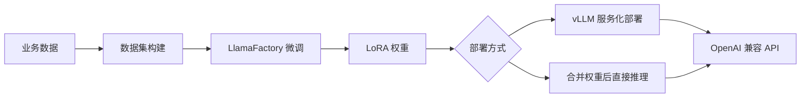

# 模块五：模型微调与推理优化

> **学习目标**：掌握 LoRA 参数高效微调的原理与实现，使用 LlamaFactory 快速完成大模型微调
>
> **前置知识**：PyTorch 基础、神经网络线性层原理
>
> **代码位置**：`05-agent-model-finetuning/`

---

## 概述

本模块涉及三个核心子方向：

| 子目录 | 内容 | 核心技能 |
|--------|------|----------|
| `lora/` | LoRA 从零实现 + PEFT 库实战 | 微调理论与代码实现 |
| `llama_factory/` | LlamaFactory 企业级微调工具 | 零代码/低代码微调 |
| `easy-dataset/` | 训练数据集构建 | 数据工程 |

---

## 子模块 5.1：LoRA 原理详解

**代码位置**：`05-agent-model-finetuning/lora/lora-from-scratch-in-google-colab.ipynb`

### 5.1.1 为什么需要参数高效微调

| 对比维度 | 全量微调 | LoRA 微调 |
|---------|----------|----------|
| **训练参数量** | 全部（数十亿） | 仅 LoRA 参数（<1%） |
| **显存占用** | 极高 | 显著降低 |
| **训练时间** | 较长 | 较短 |
| **部署成本** | 需要完整模型副本 | 只需几MB增量文件 |
| **多任务适配** | 需要多个完整模型 | 共享基座 + 多个 LoRA |
| **效果** | 最好 | 接近全量微调 |

### 5.1.2 LoRA 核心数学原理

传统全量微调的线性层：

```
h = x · W                    ← 原始前向传播
W_new = W + ΔW               ← 全量微调：直接更新所有参数
```

**LoRA 的创新**：将权重更新 ΔW 分解为两个低秩矩阵的乘积：

```
ΔW = A · B

其中：
  A ∈ ℝ^(d×r)  — 下投影矩阵（从 d 维降到 r 维）
  B ∈ ℝ^(r×k)  — 上投影矩阵（从 r 维升到 k 维）
  r << min(d,k) — 秩，远小于原始维度
```

LoRA 的前向传播：

```
h = x · W + (α/r) · x · A · B

其中 α 是缩放因子，用于控制 LoRA 分支的影响力
```

**参数量对比**（以 4096×4096 线性层为例）：

| 方法 | 参数量 | 占比 |
|------|--------|------|
| 全量微调 | 16,777,216 | 100% |
| LoRA (r=8)  | 65,536 | 0.39% |
| LoRA (r=16) | 131,072 | 0.78% |
| LoRA (r=32) | 262,144 | 1.56% |

### 5.1.3 LoRA 从零实现

```python
import torch
import torch.nn as nn

class LoRALayer(nn.Module):
    """
    LoRA 增量层：学习权重更新量 ΔW = A × B
    
    关键设计：
    - A 矩阵用随机高斯初始化（保证初始有梯度）
    - B 矩阵初始化为 0（保证训练开始时 LoRA 贡献为 0，稳定初始训练）
    - 缩放因子 α/r 控制 LoRA 分支对输出的影响强度
    """
    def __init__(self, in_features, out_features, rank, alpha):
        super().__init__()
        self.rank = rank
        self.alpha = alpha
        
        # A 矩阵：随机初始化，下投影 d → r
        self.lora_A = nn.Parameter(torch.randn(in_features, rank))
        
        # B 矩阵：零初始化，确保训练初期 ΔW = 0
        self.lora_B = nn.Parameter(torch.zeros(rank, out_features))
    
    def forward(self, x):
        # LoRA 分支：x -> A -> B，外加缩放
        return (self.alpha / self.rank) * (x @ self.lora_A @ self.lora_B)


class LinearWithLoRA(nn.Module):
    """
    将原始 nn.Linear 包装为双分支结构：
    - 主分支：冻结的原始线性层
    - LoRA 分支：可训练的低秩增量
    
    推理时将两部分输出相加，实现透明增量适配
    """
    def __init__(self, linear, rank, alpha):
        super().__init__()
        self.linear = linear    # 原始冻结权重
        self.lora = LoRALayer(  # 可训练 LoRA 层
            in_features=linear.in_features,
            out_features=linear.out_features,
            rank=rank,
            alpha=alpha
        )
    
    def forward(self, x):
        # 输出 = 原始输出 + LoRA 增量
        return self.linear(x) + self.lora(x)


def replace_linear_with_lora(model, rank, alpha):
    """
    递归替换模型中所有 nn.Linear 层为 LinearWithLoRA
    
    替换后自动冻结原始权重，只有 LoRA 的 A、B 矩阵参与训练
    """
    for name, module in model.named_children():
        if isinstance(module, nn.Linear):
            # 替换线性层
            setattr(model, name, LinearWithLoRA(module, rank, alpha))
        else:
            # 递归处理子模块
            replace_linear_with_lora(module, rank, alpha)
    
    return model
```

### 5.1.4 完整微调流程

```python
import tiktoken
from transformers import GPT2Model

# ============ 1. 加载预训练模型 ============
tokenizer = tiktoken.get_encoding("gpt2")
model = GPT2Model.from_pretrained("gpt2")

# ============ 2. 冻结原始参数 ============
for param in model.parameters():
    param.requires_grad = False

# ============ 3. 替换线性层为 LoRA 层 ============
LORA_RANK = 16    # 秩：控制增量参数量，推荐从 8-16 开始
LORA_ALPHA = 32   # 缩放因子：通常设为 2×rank

lora_model = replace_linear_with_lora(model, rank=LORA_RANK, alpha=LORA_ALPHA)

# ============ 4. 验证参数状态 ============
trainable_params = sum(p.numel() for p in lora_model.parameters() if p.requires_grad)
total_params = sum(p.numel() for p in lora_model.parameters())
print(f"训练参数量: {trainable_params:,}")
print(f"总参数量: {total_params:,}")
print(f"参数比例: {trainable_params/total_params*100:.2f}%")

# ============ 5. 训练配置 ============
optimizer = torch.optim.AdamW(
    filter(lambda p: p.requires_grad, lora_model.parameters()),
    lr=5e-4,        # LoRA 可以用比全量微调更大的学习率
    weight_decay=0.01
)

# ============ 6. 训练循环 ============
for epoch in range(num_epochs):
    lora_model.train()
    for batch in train_loader:
        input_ids, labels = batch
        
        # 前向传播
        logits = lora_model(input_ids)
        loss = torch.nn.functional.cross_entropy(logits, labels)
        
        # 反向传播
        optimizer.zero_grad()
        loss.backward()
        
        # 梯度裁剪（防止梯度爆炸）
        torch.nn.utils.clip_grad_norm_(
            lora_model.parameters(), max_norm=1.0
        )
        optimizer.step()
    
    # 验证集评估
    val_acc = evaluate(lora_model, val_loader)
    print(f"Epoch {epoch+1}: Val Acc = {val_acc:.4f}")

# ============ 7. 保存 LoRA 权重（只保存增量） ============
lora_state_dict = {k: v for k, v in lora_model.state_dict().items() 
                   if 'lora' in k}
torch.save(lora_state_dict, "lora_weights.pt")
print(f"LoRA 文件大小: {os.path.getsize('lora_weights.pt')/1024:.1f} KB")
```

### 5.1.5 超参数调优指南

```
Rank 选择：
  应用场景          推荐 rank    说明
  ─────────────────────────────────────────
  快速实验          4-8         最小参数量，快速验证
  一般任务          8-16        平衡性能与效率（推荐起点）
  复杂任务          16-32       更强表达能力
  特殊需求          32-64       接近全量微调，但失去参数优势

Alpha 选择：
  alpha = rank      标准设置
  alpha = 2 × rank  推荐设置（本模块使用）
  alpha = 4 × rank  增强 LoRA 影响

学习率：
  LoRA 微调可以使用较大学习率（5e-4 ~ 1e-3）
  全量微调建议更小（1e-5 ~ 5e-5）
```

### 5.1.6 常见问题排查

| 问题 | 症状 | 解决方案 |
|------|------|---------|
| 训练不稳定 | loss 剧烈波动 | 降低学习率、添加梯度裁剪 |
| 过拟合 | 训练好/验证差 | 减小 rank、增加 dropout |
| 收敛慢 | 很多 epoch 后 loss 仍高 | 提高学习率、增加 rank |
| 显存不足 | CUDA OOM | 减小 batch_size、启用梯度累积 |

```python
# 显存不足的解决方案：梯度累积
accumulation_steps = 4   # 等效 batch_size 乘以4倍

for i, batch in enumerate(train_loader):
    loss = compute_loss(batch) / accumulation_steps
    loss.backward()
    
    if (i + 1) % accumulation_steps == 0:
        torch.nn.utils.clip_grad_norm_(model.parameters(), 1.0)
        optimizer.step()
        optimizer.zero_grad()
```

---

## 子模块 5.2：使用 PEFT 库进行 LoRA 微调

**代码位置**：`05-agent-model-finetuning/lora/lora-from-peft-in-google-colab.ipynb`

### 5.2.1 PEFT 库介绍

Hugging Face 的 `peft`（Parameter-Efficient Fine-Tuning）库提供了工业级的 LoRA 实现，支持几十种大语言模型，无需手写 LoRA 替换逻辑：

```bash
pip install peft transformers torch
```

### 5.2.2 PEFT LoRA 核心代码

```python
from peft import LoraConfig, get_peft_model, TaskType
from transformers import AutoModelForCausalLM, AutoTokenizer

# 1. 加载基础模型
model_name = "gpt2"  # 或 "meta-llama/Llama-2-7b-hf" 等
model = AutoModelForCausalLM.from_pretrained(model_name)
tokenizer = AutoTokenizer.from_pretrained(model_name)

# 2. 配置 LoRA
lora_config = LoraConfig(
    r=16,                           # 秩
    lora_alpha=32,                  # 缩放因子
    target_modules=["c_attn", "c_proj"],  # 要替换的模块（注意力层）
    lora_dropout=0.05,              # 防止过拟合
    bias="none",                    # 偏置处理方式
    task_type=TaskType.CAUSAL_LM    # 任务类型
)

# 3. 应用 LoRA（自动冻结基础参数）
peft_model = get_peft_model(model, lora_config)
peft_model.print_trainable_parameters()
# 输出：trainable params: 294,912 || all params: 124,734,720 || trainable%: 0.23%

# 4. 正常训练（与普通 PyTorch 训练完全一致）
optimizer = torch.optim.AdamW(peft_model.parameters(), lr=5e-4)

for epoch in range(num_epochs):
    for batch in train_loader:
        outputs = peft_model(**batch)
        loss = outputs.loss
        loss.backward()
        optimizer.step()
        optimizer.zero_grad()

# 5. 保存 LoRA 权重（只保存增量，压缩效果显著）
peft_model.save_pretrained("./lora_checkpoint")
# 文件夹只包含几MB的 adapter_model.bin

# 6. 加载并推理
from peft import PeftModel
base_model = AutoModelForCausalLM.from_pretrained(model_name)
model_with_lora = PeftModel.from_pretrained(base_model, "./lora_checkpoint")
```

---

## 子模块 5.3：LlamaFactory 企业级微调

**代码位置**：`05-agent-model-finetuning/llama_factory/`

### 5.3.1 LlamaFactory 介绍

LlamaFactory 是目前最流行的大语言模型微调工具链，支持：
- **100+ 大语言模型**（LLaMA/Qwen/DeepSeek/ChatGLM/Baichuan 等）
- **6 种微调方法**（SFT/RLHF/DPO/LoRA/QLoRA/GaLore）
- **可视化界面**（WebUI）无需写代码
- **4-bit/8-bit 量化**降低显存需求

### 5.3.2 环境安装

```bash
# 克隆仓库
git clone https://github.com/hiyouga/LLaMA-Factory.git
cd LLaMA-Factory

# 安装核心依赖
pip install -e ".[torch,metrics]"

# 验证安装
llamafactory-cli version
```

### 5.3.3 方式一：Web UI（推荐新手）

```bash
# 启动可视化界面（本地）
llamafactory-cli webui
# 访问 http://localhost:7860

# 在界面中：
# 1. 选择模型（如 Qwen2.5-7B）
# 2. 选择数据集（内置 100+ 数据集），或上传自定义数据
# 3. 配置 LoRA 参数（rank/alpha/目标层）
# 4. 选择训练方式（SFT/DPO等）
# 5. 一键开始训练
```

### 5.3.4 方式二：命令行（推荐生产环境）

```bash
# SFT 微调（监督指令微调）
llamafactory-cli train \
    --model_name_or_path Qwen/Qwen2.5-7B-Instruct \
    --method lora \
    --dataset alpaca_zh \
    --template qwen \
    --output_dir ./output/qwen-lora \
    --per_device_train_batch_size 2 \
    --gradient_accumulation_steps 8 \
    --num_train_epochs 3 \
    --learning_rate 5e-4 \
    --lora_rank 16 \
    --lora_alpha 32 \
    --lora_target all \
    --fp16                          # 混合精度训练（节省显存）
```

### 5.3.5 方式三：Python API（推荐集成开发）

```python
from llamafactory.train.tuner import run_exp

# 等效于命令行参数的字典形式
args = {
    "model_name_or_path": "Qwen/Qwen2.5-7B-Instruct",
    "method": "lora",
    "dataset": "alpaca_zh",
    "template": "qwen",
    "output_dir": "./output/qwen-lora",
    "per_device_train_batch_size": 2,
    "num_train_epochs": 3,
    "learning_rate": 5e-4,
    "lora_rank": 16,
    "lora_alpha": 32,
    "lora_target": "all",
}

run_exp(args)
```

### 5.3.6 自定义数据集格式

```json
// 指令微调格式（alpaca_zh 风格）
[
    {
        "instruction": "给我推荐3个上海2天2夜的旅行路线",
        "input": "",
        "output": "**路线一：经典老上海**\n第一天：外滩→豫园→城隍庙\n第二天：新天地→思南路咖啡馆\n\n**路线二：艺术文化游**\n..."
    },
    {
        "instruction": "计算旅行预算",
        "input": "目的地：杭州，3天，2人，中等消费",
        "output": "预计总费用：3600-4800元\n- 交通：600元（高铁）\n- 住宿：1200-1800元\n- 餐饮：600元（按100元/人/天）\n- 景点：400元..."
    }
]
```

```bash
# 注册自定义数据集（在 data/dataset_info.json 中添加）
{
    "my_travel_dataset": {
        "file_name": "my_travel_data.json",
        "columns": {
            "prompt": "instruction",
            "query": "input",
            "response": "output"
        }
    }
}

# 使用自定义数据集训练
llamafactory-cli train \
    --dataset my_travel_dataset \
    ...
```

### 5.3.7 合并 LoRA 权重（部署前）

```bash
# 将 LoRA 增量合并回基础模型（得到完整模型，推理更快）
llamafactory-cli export \
    --model_name_or_path Qwen/Qwen2.5-7B-Instruct \
    --adapter_name_or_path ./output/qwen-lora \
    --template qwen \
    --finetuning_type lora \
    --export_dir ./output/qwen-merged \
    --export_size 4       # 每个分片最大 4GB
```

---

## 子模块 5.4：推理优化

### 5.4.1 vLLM 高性能推理

vLLM 是目前最快的开源 LLM 推理引擎，相比 Transformers 原生推理提速 10-30 倍：

```bash
pip install vllm
```

```python
from vllm import LLM, SamplingParams

# 加载模型（自动支持 PagedAttention 内存优化）
llm = LLM(
    model="./output/qwen-merged",  # 微调后合并的模型路径
    max_model_len=8192,
    gpu_memory_utilization=0.9     # 使用 90% GPU 显存
)

# 批量推理（高效）
prompts = [
    "帮我规划一个杭州3天旅行",
    "推荐上海的米其林餐厅",
    "故宫参观攻略"
]

sampling_params = SamplingParams(
    temperature=0.7,
    top_p=0.9,
    max_tokens=512
)

outputs = llm.generate(prompts, sampling_params)

for output in outputs:
    print(f"提示: {output.prompt[:30]}...")
    print(f"输出: {output.outputs[0].text}")
    print("---")
```

```python
# 或者以 OpenAI兼容 API 方式启动服务
# vllm serve ./output/qwen-merged \
#   --host 0.0.0.0 \
#   --port 8000 \
#   --served-model-name my-travel-model

# 客户端调用（与 OpenAI SDK 完全兼容）
from openai import OpenAI
client = OpenAI(base_url="http://localhost:8000/v1", api_key="dummy")
response = client.chat.completions.create(
    model="my-travel-model",
    messages=[{"role": "user", "content": "帮我规划杭州3天旅行"}]
)
```

---

## 模块总结

### 三种方式对比

| 方式 | 适用场景 | 灵活性 | 上手难度 |
|------|---------|--------|---------|
| LoRA 从零实现 | 学习原理、特殊研究 | 最高 | 高 |
| PEFT 库 | 工程实践，标准微调任务 | 高 | 中 |
| LlamaFactory | 快速出效果，多模型支持 | 中 | 低 |

### 微调流程



### 学习路径

```
LoRA 原理理解（5.1）→ 理解低秩分解的数学思想
       ↓
从零实现 LoRA（5.1.3）→ 加深对算法的理解
       ↓
PEFT 库实践（5.2）→ 工业级实现，高效且稳定
       ↓
LlamaFactory 工具（5.3）→ 快速上手7B+大模型微调
       ↓
vLLM 推理部署（5.4）→ 生产化部署高性能服务
```

### 推荐练习

1. **微调垃圾邮件分类**：在 SMS Spam Collection 数据集上分别用 rank=4/8/16 训练，对比准确率和训练时间
2. **微调旅行规划模型**：构建旅行规划问答数据集（模块3的旅行规划结果），用 LlamaFactory 微调 Qwen-7B
3. **对比推理速度**：相同模型用 Transformers 原生推理和 vLLM 并发推理，记录吞吐量差异
